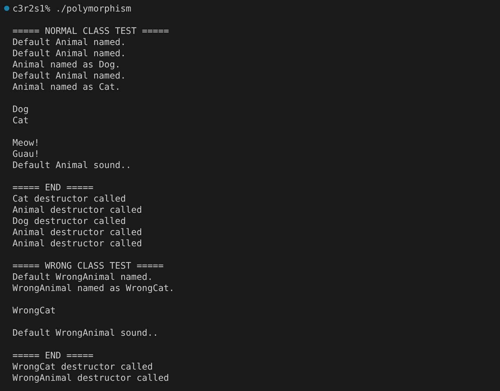
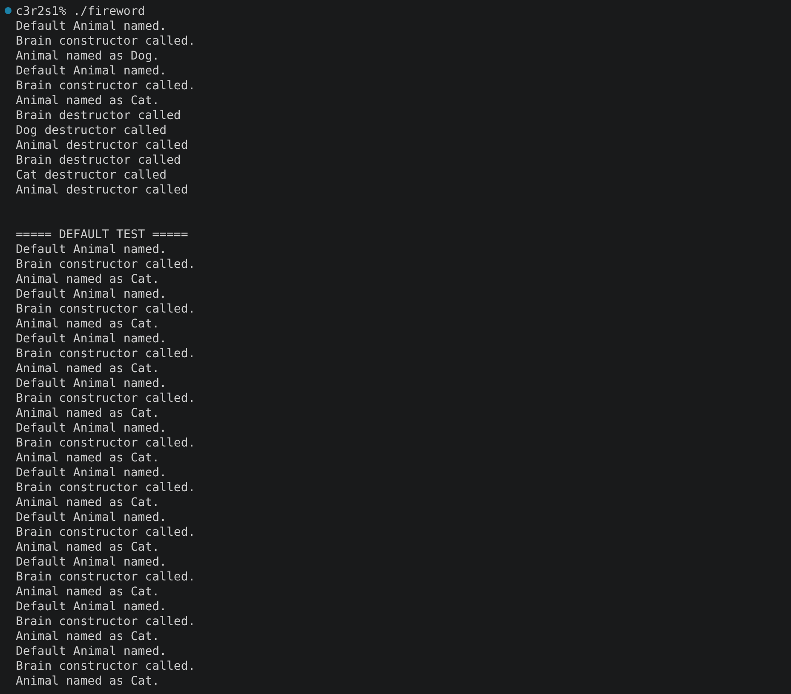
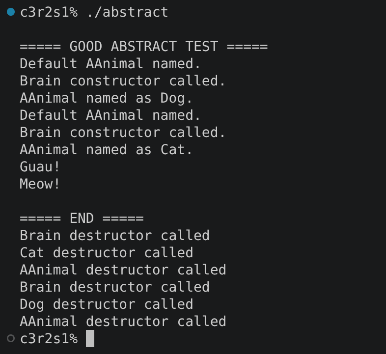

# cpp_module_04


### Clarifications and general tips:
* If you find any kind of error or have suggestions to improve, please do not hesitate to point them out in the `issues` section! Obviously always respectfully, thank you :D.
* Check the projects for memory leaks. In these ones there are more than in the previous project.
* Provide additional tests beyond the main examples from the subject. Especially, add ones that prove each new knowledge that you acquire in each exercise.
* Always remmember that the output examples are just examples. They can vary in your own project and still be fine.


## ex00: Polymorphism

### Mandatory requirements:
* Create a class `Animal` implementing the following attribute: 
    * Protected `std::string type` attribute.
* Create `Dog` and `Cat` classes that inherit from `Animal`. Each class must initialize their respective types at the beginning of the program: `Dog` must have the type `"Dog"` and `Cat` the type `"Cat"`.
* Implement `makeSound()` so that each class produces its appropriate sound for each animal.
* Implement a `WrongAnimal` class and a `WrongCat` class to demonstrate the difference between normal inheritance and polymorphic behavior. The Wrong classes output should be different from the normal classes output, even though their implementations are similar to the original classes.
* Constructors and destructors must display different messages for each class.
* Test it with the following main:
```
int main()
{
    const Animal* meta = new Animal();
    const Animal* j = new Dog();
    const Animal* i = new Cat();

    std::cout << j->getType() << " " << std::endl;
    std::cout << i->getType() << " " << std::endl;
    i->makeSound(); //will output the cat sound!
    j->makeSound();
    meta->makeSound();

    //Your Code and tests.

    return 0;
}
```
### What can we learn about this exercise?:
This exercise introduces **subtype polymorphism**, inheritance and the importance of virtual functions when working with objects through base-class pointers. The important thing that you need to know to start your investigation, is that when a function is 'virtual' (in this case at least), C++ uses the type of the object to determine which overridden implementation to execute at runtime, but you must know how to use it. Do not forget virtual destructors too.

### Output example:


---

## ex01: I don't want to set the world on fire

### Mandatory requirements:
* First take the files from previous exercise and use them as a start of this exercise.
* Implement a `Brain` class adding the following attribute:
    * An array of **100 `std::string` ideas**.
* `Dog` and `Cat` must each contain a new attribute:
    * A private `Brain*`, it must be dynamically allocated when a `Dog` or `Cat` is constructed and deleted when it is destroyed.
* Create an array of `Animal` objects containing both Dogs and Cats (make them be half dogs and half cats). This array must be cleaned through `Animal` pointers, also ensure the correct destructors are called.
* Implement **deep copies** for `Dog` and `Cat` and test them to make sure they do not share the same `Brain`.
* Test it with the following main:
```
int main()
{
    const Animal* j = new Dog();
    const Animal* i = new Cat();

    delete j;//should not create a leak
    delete i;

    //Your Code and tests.

    return 0;
}
```

### What can we learn about this exercise?:
The main concepts are **dynamic memory management**, deep copying, ownership and polymorphism through base-class pointers. One thing that can help you with the exercise is that in the normal copies you copy a pointer and the copy and the original point to the same object, in the **deep copies** a new object is created, and is independent from the original one.

### Output example:


---

## ex02: Abstract class

### Mandatory requirements:
* First take the files from previous exercise and use them as a start of this exercise.
* Modify the `Animal` class so that it **cannot be instantiated**.
* Keep the behavior of `Dog` and `Cat` working as in the previous exercise.
* To detail the difference, the subject asks you to add an A to the new Animal class.

### What can we learn about this exercise?:
This exercise introduces the concept of **abstract classes**, to know more you must start by knowing what the **pure virtual functions** are. From this point you can develop and solve the exercise.

### Output example:


---

### Last but not least, check out these other repositories if you feel lost, they helped me a lot through the project:

https://github.com/zpalfi42/CPP04/blob/main/ex00/src/main.cpp

https://github.com/Kromolux/42_cpp_04/blob/master/ex02/AAnimal.cpp